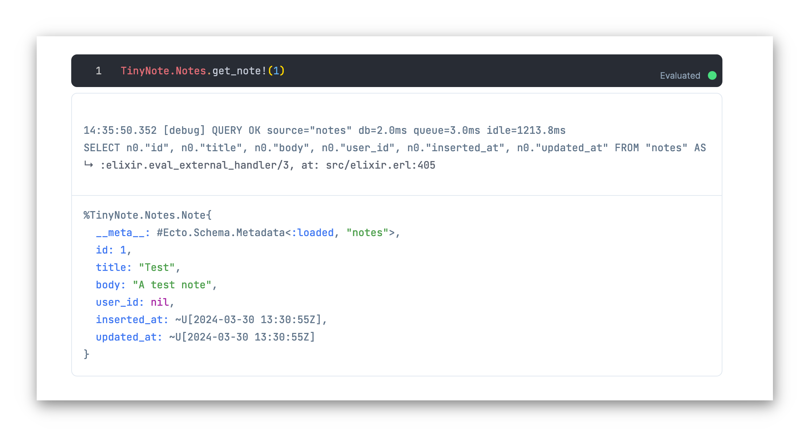

# TinyNote - A Phoenix/Livebook/Docker Demo

This repo is a demonstration of running livebook alongside a phoenix app in docker.

We can use livebook to run code on the phoenix server.

## Setup

- Run `docker-compose up`
- Open http://localhost:4000/users/register and create an account 
- Open http://localhost:4000/notes and create a few notes 
- Look in the logs for the livebook container to find the livebook url 
- Open livebook 
- Create a new notebook
- You can run code in the phoenix node, like `TinyNote.Accounts.get_user!(1)`
